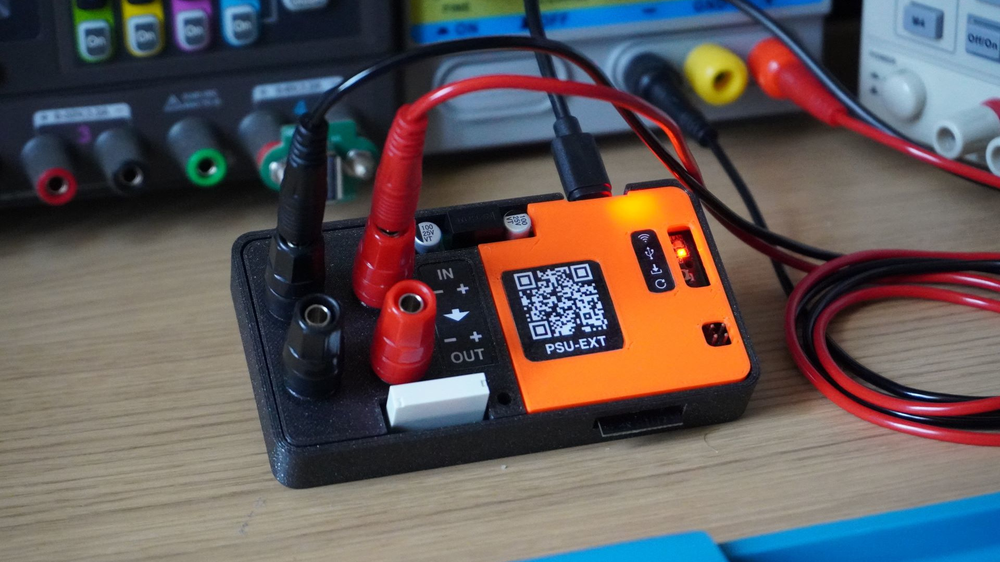
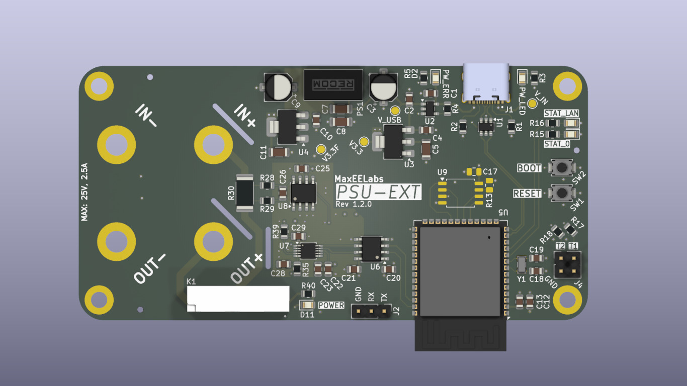

<h1 align="center">PSU-EXT Hardware</h1>

  An open-hardware inline extension that adds measurement, protection, and
  programmable control to an existing bench power supply.

  
  
  
  

> **EVT prototype:** PSU-EXT is an engineering-validation design, not a
> finished or certified consumer product. It extends a bench PSU; it is not a
> standalone power supply. Use it only within the stated ratings and with
> appropriate laboratory safety practices.

  
  

## What it does

PSU-EXT sits between a bench power supply and a load or device under test. It
measures output voltage and current, controls the output path with a relay, and
makes the setup easier to monitor and automate.

- Live voltage, current, and power telemetry
- Relay-controlled output enable/disable
- Galvanically isolated control and measurement domains
- SCPI control over USB CDC and TCP through the companion firmware and software
- External trigger inputs, timer support, and configurable OVP/OCP behaviour

## Hardware at a glance

> **Warning:** PSU-EXT does not provide reverse-polarity protection. Verify
> supply and load polarity before connecting the device.

| Item | Details |
| --- | --- |
| Operating range | 0–25 V, 0–2.5 A |
| Board size | 100 × 50 mm (3.94 × 1.97 in) |
| Control connection | USB-C for power and data |
| Controller | Espressif ESP32-S3 |
| Measurement | ADS1115 ADC and INA240 current-sense front end |
| Isolation | Isolated I²C and isolated DC-DC power for the measurement domain |

## Repository contents

- [`electronics/`](electronics/) — KiCad schematics, PCB, libraries, and the
  [schematic PDF export](electronics/exports/schematic.pdf)
- [`mechanical/`](mechanical/) — FreeCAD enclosure design and label artwork
- [`manufacturing/`](manufacturing/) — Gerbers, BOM, and pick-and-place (CPL)
  files for fabrication and assembly
- [`THIRD-PARTY-NOTICES.md`](THIRD-PARTY-NOTICES.md) — attribution and licence
  information for bundled library assets

The design was created with [**FreeCAD 1.1.1**](https://www.freecad.org/) and
[**KiCad 10.0.1**](https://www.kicad.org/).

## Related PSU-EXT projects

- [PSU-EXT Root](https://github.com/PSU-Ext-Org/psu-ext)
- [Firmware](https://github.com/PSU-Ext-Org/psu-ext-firmware)
- [Control software](https://github.com/PSU-Ext-Org/psu-ext-software)

## Licence

Original PSU-EXT hardware design sources are licensed under the
[CERN Open Hardware Licence Version 2 - Strongly Reciprocal](LICENCE)
(CERN-OHL-S v2). The source location is
<https://github.com/PSU-Ext-Org/psu-ext>.

Some library assets are separately licensed. See [NOTICE](NOTICE),
[THIRD-PARTY-NOTICES.md](THIRD-PARTY-NOTICES.md), and
[LICENSES/dep5](LICENSES/dep5) before copying or modifying them.

Changes to the design are recorded in [CHANGES.txt](CHANGES.txt).
